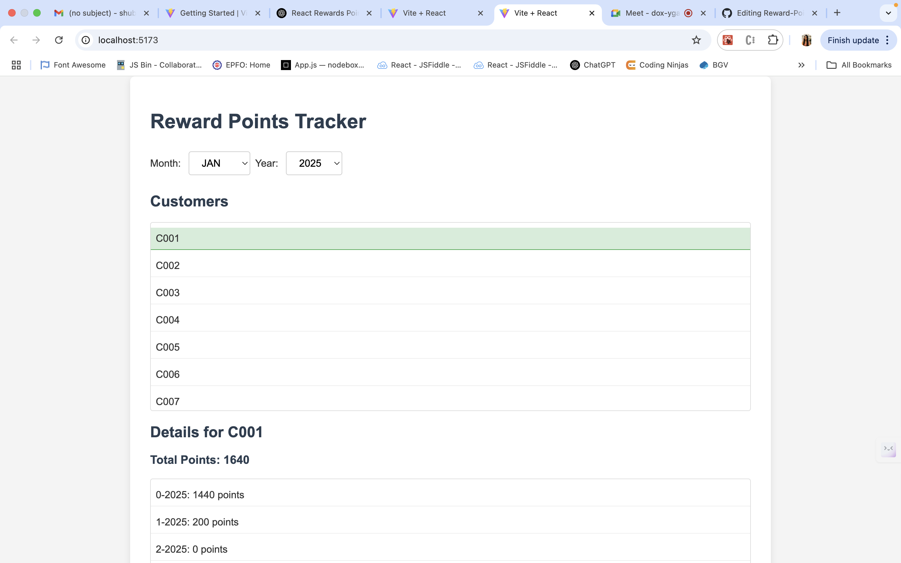
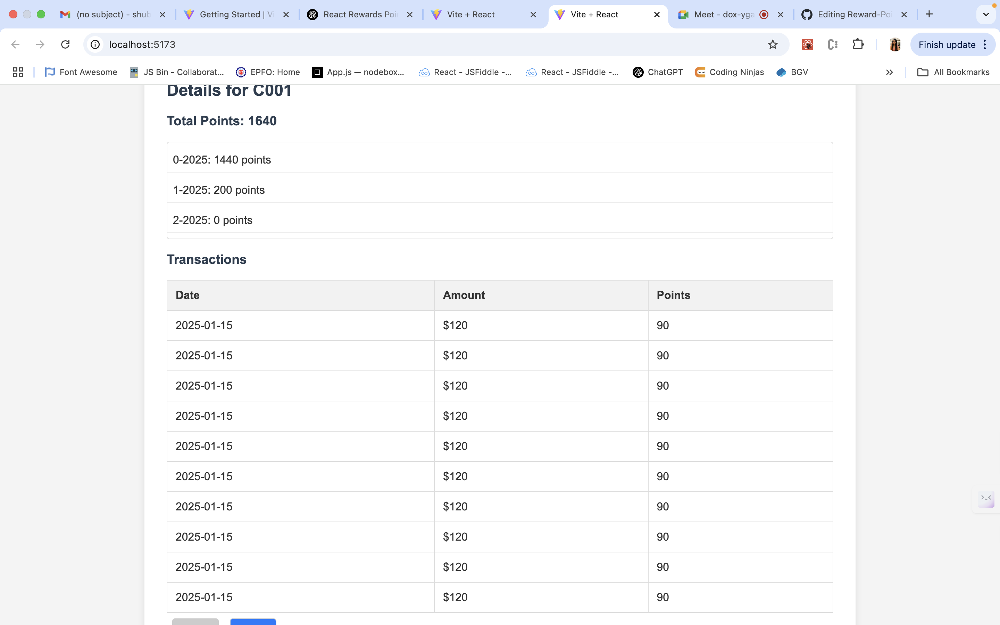
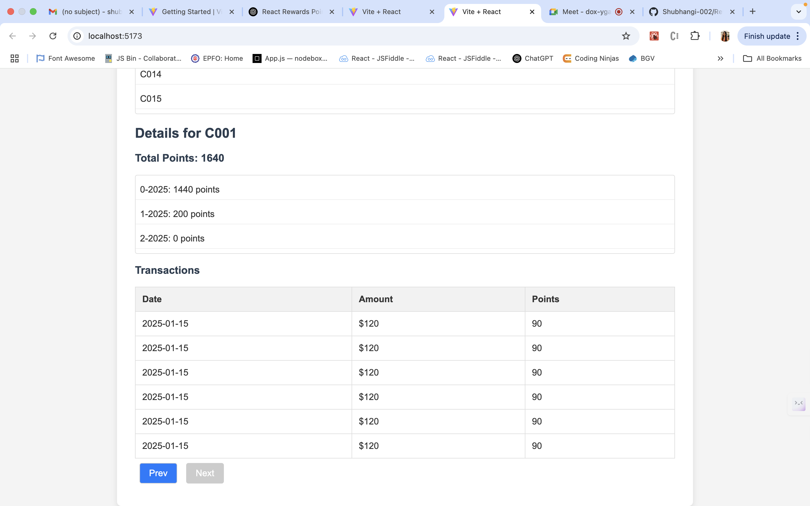
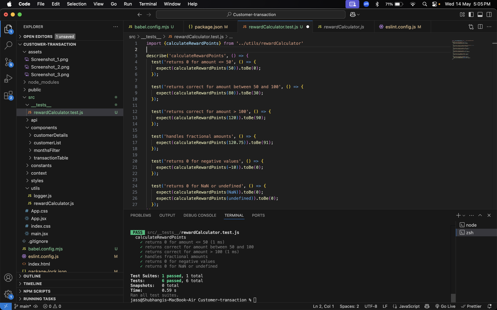

# Reward Points Tracker 

A ReactJS application to track and display customer reward points earned from purchases over a 3-month period.

## Project Objective

A retailer offers a rewards program that provides:
- **2 points** for every dollar spent **over $100**
- **1 point** for every dollar spent **between $50 and $100**

For example:  
A `$120` transaction earns `2 * 20 + 1 * 50 = 90 points`.

This app allows:
- Viewing reward points per customer by month and in total.
- Filtering by month/year.
- Viewing individual transactions with reward breakdown.
- Paginated view for large datasets.
- Loading, error handling, logging, and unit tests.

---

## Technologies Used

- ReactJS (Functional Components)
- React Context API (no Redux)
- CSS
- Local mock JSON (asynchronous API simulation)
- Logging (custom logger utility)

---

## Setup Instructions

### 1. Clone the Repository
```bash
git clone https://github.com/Shubhangi-002/Reward-Points-Tracker.git
cd Reward-Points-Tracker

## Working App and Test case Screenshot








